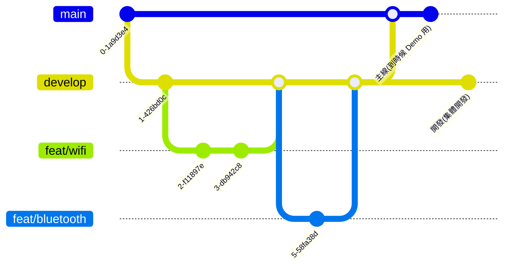

# TownPass

TownPass project made with Flutter.

## Getting Started

### Recommended IDE Setup
- Android Studio + Flutter plugin
- VSCode + Flutter extension

### CI/CD



### Project Setup 1: Init Flutter Env
請參考官方文檔的'安裝 Flutter SDK'
： https://townpass.taipei/docs/flutter/home/install/macOS-iOS-setup.html#zsh
1. 安裝完 flutter SDK 後，使用 flutter doctor -v 檢查安裝，如果失敗可以重啟 VScode 看看

### Project Setup 2: Run Flutter APP
2. Run the following to get the packages project needed:

   ``` bash
   flutter pub get
   ```

3. Run the following to generate additional needed dart code for the project.

   ``` bash
   flutter packages pub run build_runner build --delete-conflicting-outputs
   ```
4. You are all set now, Run the project from IDE or the command:

   * 請先開啟 xcode simulator
      ```
      xcrun simctl list devices

      == Devices ==
      -- iOS 17.5 --
         iPhone 15 Pro Max (53CEAA9A-8CB3-46CB-BD6D-06024B76A9DC) (Shutdown) 
      ```
      ```
      open -a Simulator --args -CurrentDeviceUDID 53CEAA9A-8CB3-46CB-BD6D-06024B76A9DC
      ```
      
   * 用 flutter devices 列出你可能有的 Devices，並且使用 flutter run -d <device id> 來選擇 Device。以下舉例：
      ```
      flutter devices

      Found 4 connected devices:
         iPhone 15 Pro Max (mobile)      • 53CEAA9A-8CB3-46CB-BD6D-06024B76A9DC • ios
         • com.apple.CoreSimulator.SimRuntime.iOS-17-5 (simulator)
         macOS (desktop)                 • macos                                •
         darwin-arm64   • macOS 14.1.1 23B81 darwin-arm64
         Mac Designed for iPad (desktop) • mac-designed-for-ipad                •
         darwin         • macOS 14.1.1 23B81 darwin-arm64
         Chrome (web)                    • chrome                               •
         web-javascript • Google Chrome 128.0.6613.86
      ```
      ```
      flutter run -d 53CEAA9A-8CB3-46CB-BD6D-06024B76A9DC
      ```

   * 團隊統一使用 iPhone 15 Pro Max 裝置開發


### 如何客製化自己的 Web-View 在 APP 內
1. 添加新的 LOGO 在 assets/image，這邊叫做 persevering-face-emoji.png
2. 運行 flutter pub run build_runner build --delete-conflicting-outputs
   - 他會根據 pubspec.yaml 的 flutter.assets.assets/image/ 在 lib/gen/assets.gen.dart 建立對應 resource
3. 在 lib/page/city_service/model/my_service_item_model.dart 的 extension MyServiceIdExt on MyServiceItemId 新增以下 code，xxx 為自己填寫
```
 MyServiceItemId.dedicatedLine => MyServiceItem(
          title: 'xxxx',
          description: 'xxxx',
          icon: Assets.image.perseveringFaceEmoji.image(), // 這邊是根據圖片種類、名稱而定
          category: MyServiceCategory.cityService,
          destinationUrl: 'xxxxx',
        )
```
4. 在 destinationUrl: 'xxxxx' 填寫上自己 web-view 的 URL


